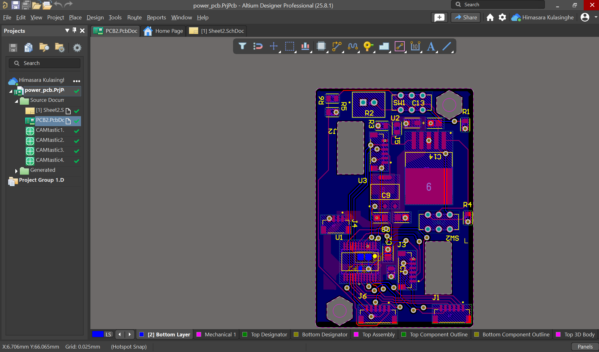
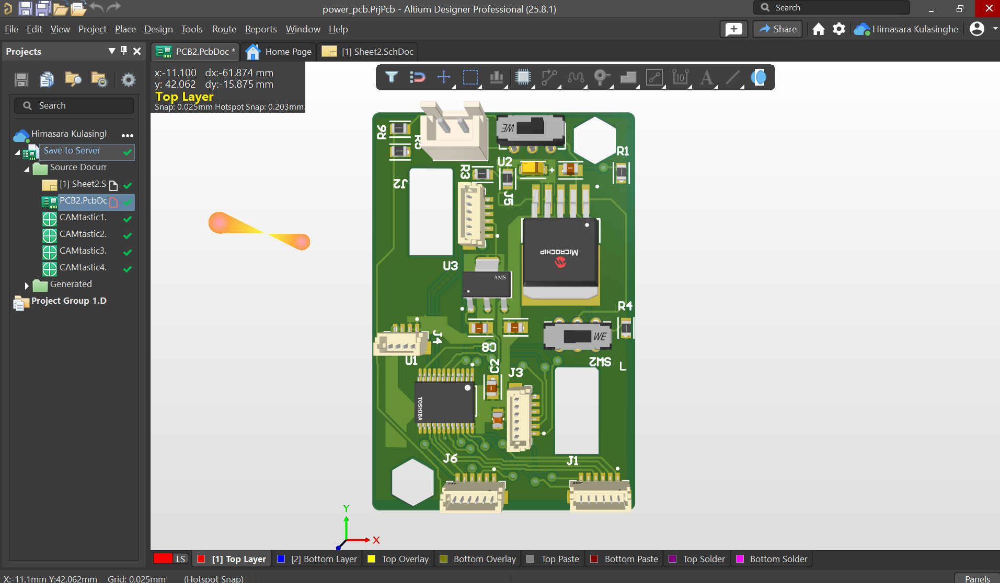
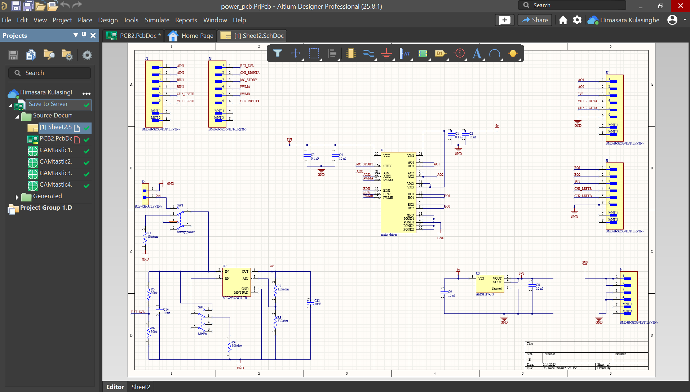

# Micromouse Power PCB 

This repository contains the **Power PCB design** for the Micromouse project.  
The board is designed to provide stable power distribution to the Micromouse robot, ensuring reliable operation of its sensors, motors, and control electronics.

---

##  Repository Contents
- **schematic/** → Circuit schematic files  
- **pcb-layout/** → PCB design files  
- **gerbers/** → Gerber files for fabrication  
- **bom/** → Bill of Materials (BOM)  
- **images/** → PCB & schematic previews  
- **README.md** → Project documentation  

---

##  Tools Used
- **PCB Design Software:** Altium  
- **Version Control:** Git + GitHub  

---

##  Features
- Onboard voltage regulation for different modules  
- Power distribution optimized for motors and microcontroller  
- Decoupling capacitors for noise reduction  
- Compact form factor suitable for Micromouse design  

---

## 📸 PCB Previews

### PCB Layout (Top View)

### PCB 3D View

### Schematic

